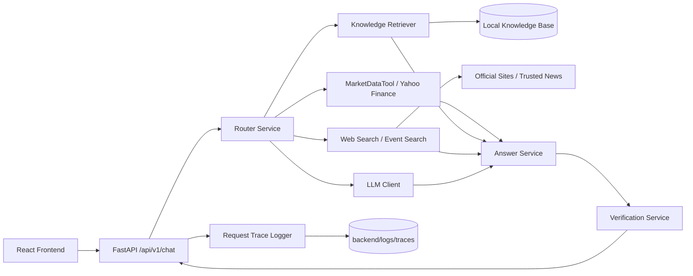

# Finance Asset QA System

## 当前状态

当前已完成阶段 0 到阶段 6：

- 前端基础工程目录
- 后端 FastAPI 基础工程目录与问答主链路
- 资产价格/走势问答
- 中文优先的 RAG 知识库与财报摘要能力
- Prompt 模板、结构化生成与校验层
- 前端 MVP 页面与端到端联调
- phase 6 联调、日志、题型回归与交付整理
- 环境变量模板
- 阶段文档

## 系统架构图



## 环境要求

- Conda 环境：`finance-qa`
- Python：3.11
- Node.js：已安装
- npm：已安装

## 后端启动

先安装依赖：

```bash
conda run -n finance-qa python -m pip install -r backend/requirements.txt
```

可选环境变量：

```bash
export LLM_PROVIDER=ollama
export OLLAMA_MODEL=llama3.1:8b
export LLM_ENABLE_ROUTING=true
```

如果改用 OpenAI：

```bash
export LLM_PROVIDER=openai
export OPENAI_API_KEY=你的_key
export OPENAI_MODEL=gpt-5.1
```

本地演示推荐：

```bash
export LLM_PROVIDER=ollama
export OLLAMA_MODEL=llama3.1:8b
export LLM_ENABLE_ROUTING=true
export LLM_ENABLE_QUERY_REWRITE=true
export LLM_ENABLE_GENERATION=false
export LLM_ENABLE_VERIFICATION=false
```

再启动服务：

```bash
conda run -n finance-qa uvicorn app.main:app --reload --app-dir backend
```

后端健康检查：

```bash
curl http://127.0.0.1:8000/api/v1/health
```

## 前端启动

先安装依赖：

```bash
cd frontend
npm install
```

再启动开发服务器：

```bash
cd frontend
npm run dev
```

默认访问：

```text
http://127.0.0.1:5173
```

说明：

- 前端开发服务器已配置 `/api` 代理到 `http://127.0.0.1:8000`
- 默认无需额外配置 `VITE_API_BASE_URL`
- 如果前后端分开部署，可通过 `VITE_API_BASE_URL` 指定后端地址

## 目录说明

- `backend/`: FastAPI 后端
- `frontend/`: React + TypeScript + Vite 前端
- `docs/`: 架构与执行文档

## 阶段 0 验证

- 后端路由已确认包含 `/api/v1/health`
- 后端测试：`conda run -n finance-qa python -m pytest tests/test_health.py -q`
- 前端构建：`cd frontend && npm run build`

说明：

当前 Codex 沙箱禁止本地端口监听，因此本轮验证采用后端测试与前端构建通过作为阶段 0 的可运行依据。

## 阶段 1 接口示例

资产类问题：

```bash
curl -X POST http://127.0.0.1:8000/api/v1/chat \
  -H "Content-Type: application/json" \
  -d '{"message":"阿里巴巴当前股价是多少？"}'
```

知识类问题：

```bash
curl -X POST http://127.0.0.1:8000/api/v1/chat \
  -H "Content-Type: application/json" \
  -d '{"message":"什么是市盈率？"}'
```

说明：

- 阶段 1 返回的是主链路骨架响应
- 已具备统一请求结构、统一响应结构、基础意图路由和错误处理
- 真实行情、RAG 和生成链路会在后续阶段补齐

## 阶段 2 接口示例

安装新增依赖：

```bash
cd backend
conda run -n finance-qa python -m pip install -r requirements.txt
```

直接查询价格：

```bash
curl http://127.0.0.1:8000/api/v1/assets/BABA/price
```

直接查询历史走势：

```bash
curl "http://127.0.0.1:8000/api/v1/assets/BABA/history?days=7"
```

通过统一问答接口查询走势：

```bash
curl -X POST http://127.0.0.1:8000/api/v1/chat \
  -H "Content-Type: application/json" \
  -d '{"message":"BABA 最近 7 天涨跌情况如何？"}'
```

说明：

- 阶段 2 已接入 Yahoo Finance 市场数据
- 已支持当前价格、最近 7/30 天趋势分析、基础走势图数据
- “为什么涨跌”这类事件归因仍未接入新闻与公告检索，当前只会明确降级说明

## 阶段 3：RAG 知识库

知识库目录：

- `backend/data/knowledge/source_manifest.json`: 知识源清单
- `backend/data/knowledge/raw/`: 原始下载文件
- `backend/data/knowledge/processed/`: 结构化文本
- `backend/data/knowledge/index/`: 切块与向量索引

当前知识库以中文资料为主，包含：

- 中国证监会投教文章
- 腾讯、阿里巴巴、宁德时代、小米、贵州茅台、招商银行等公司披露材料
- Apple、Tesla 等英文补充材料

运行时公司覆盖策略：

- 本地知识库优先使用已入库的中文/英文官方资料
- 若本地未命中，则降级到官方网页检索
- 当前已内置当前中美市值前 10 公司别名和官方域名清单，便于网页检索兜底

当前内置的中美重点公司包括：

- 中国：Tencent、ICBC、Agricultural Bank of China、China Construction Bank、Alibaba、PetroChina、CATL、Bank of China、Moutai、China Mobile
- 美国：NVIDIA、Alphabet、Apple、Microsoft、Amazon、Broadcom、Meta、Tesla、Berkshire Hathaway、Walmart

重建知识库：

```bash
cd backend
conda run -n finance-qa python scripts/build_knowledge_base.py
```

通过 API 重建索引：

```bash
curl -X POST http://127.0.0.1:8000/api/v1/rag/ingest
```

知识问答示例：

```bash
curl -X POST http://127.0.0.1:8000/api/v1/chat \
  -H "Content-Type: application/json" \
  -d '{"message":"什么是市盈率？"}'
```

财报摘要示例：

```bash
curl -X POST http://127.0.0.1:8000/api/v1/chat \
  -H "Content-Type: application/json" \
  -d '{"message":"腾讯最近财报摘要是什么？"}'
```

阶段 3 验证：

- 自动化测试：`cd backend && conda run -n finance-qa python -m pytest tests -q`
- 实际索引构建：`cd backend && conda run -n finance-qa python scripts/build_knowledge_base.py`
- 接口检查：`/api/v1/chat`、`/api/v1/rag/ingest`

网页检索回退示例：

```bash
curl -X POST http://127.0.0.1:8000/api/v1/chat \
  -H "Content-Type: application/json" \
  -d '{"message":"英伟达最近财报摘要是什么？"}'
```

说明：

- 如果本地知识库未覆盖目标公司，系统会检索官方 IR / SEC / Investor.gov 页面
- 当前网页检索只接受官方域名结果，避免把回答建立在论坛或二手转载上

## 阶段 4：Prompt、结构化生成与校验

当前支持两类 LLM 提供方：

- `ollama`：本地模型，当前已实测 `llama3.1:8b` 与 `phi4-reasoning:14b`
- `openai`：官方 `openai` Python SDK，走 `Responses API`

关键环境变量：

```bash
LLM_PROVIDER=ollama
LLM_ENABLE_ROUTING=true
LLM_ENABLE_GENERATION=true
LLM_ENABLE_QUERY_REWRITE=true
LLM_ENABLE_VERIFICATION=true
LLM_TIMEOUT_SECONDS=120
OLLAMA_BASE_URL=http://127.0.0.1:11434
OLLAMA_MODEL=llama3.1:8b
OPENAI_API_KEY=
OPENAI_BASE_URL=https://api.openai.com/v1
OPENAI_MODEL=gpt-5.1
OPENAI_REASONING_EFFORT=medium
```

当前 Prompt/校验链路包括：

- `router`: 规则抽取 + LLM 路由合并
- `query_rewrite`: 把用户问题改写为更适合本地检索与官方网页检索的查询
- `answer_generation`: 基于草稿回答做结构化归纳，不允许发明数字和来源
- `verification`: 二次检查结构、来源边界和结论越界

当前保守规则：

- 知识问答和财报摘要在 `source_mode=not_found` 或 `sources=[]` 时，不允许 LLM 用常识补答
- 中文概念词条会优先尝试本地中文知识库，未命中时可回退到 `Investor.gov` 等英文官方源
- 资产价格类回答允许 LLM 做轻量润色，但不会修改 `objective_data` 中的客观数字

本地 Ollama 冒烟测试：

```bash
curl -X POST http://127.0.0.1:8000/api/v1/chat \
  -H "Content-Type: application/json" \
  -d '{"message":"BABA 当前股价是多少？"}'

curl -X POST http://127.0.0.1:8000/api/v1/chat \
  -H "Content-Type: application/json" \
  -d '{"message":"什么是市盈率？"}'
```

阶段 4 验证：

- 单元测试：`conda run -n finance-qa python -m pytest backend/tests -q`
- 本地结构化生成：已验证 `OllamaLLMClient` 可返回可解析 JSON
- OpenAI 接口：已验证无 `OPENAI_API_KEY` 时安全降级；配置 key 后可切换到官方接口

OpenAI 接口实现说明：

- 当前使用官方 `openai` Python SDK
- 新接口优先采用 `Responses API`
- 结构化输出使用 `client.responses.parse(...)`

相关文档：

- `docs/prompt-design.md`
- `docs/working-plan.md`

## 阶段 5：前端 MVP

当前前端已提供一个单页演示界面，包含：

- 问答输入区
- 结构化回答摘要
- 客观数据表格
- 分析说明、来源、限制说明
- 资产问题对应的价格走势图

页面当前行为：

- 调用主接口：`POST /api/v1/chat`
- 资产类回答会自动补拉 `GET /api/v1/assets/{symbol}/history`
- 知识问答和财报摘要不展示图表，只展示结构化结果

阶段 5 验证：

- 前端构建：`cd frontend && npm run build`
- 后端测试：`conda run -n finance-qa python -m pytest backend/tests -q`
- 前后端联调：

```bash
curl -X POST http://127.0.0.1:5173/api/v1/chat \
  -H "Content-Type: application/json" \
  -d '{"message":"BABA 当前股价是多少？"}'

curl "http://127.0.0.1:5173/api/v1/assets/BABA/history?days=30"
```

当前已验证：

- `http://127.0.0.1:5173` 可正常返回前端页面
- 前端代理到后端的 `/api` 请求可正常工作
- 资产问答和知识问答都可在端到端链路上返回结构化结果

## 阶段 6：联调、Trace 与回归

阶段 6 新增内容：

- LLM 路由：`RouterService` 已支持 `规则抽取 + LLM 结构化路由`
- 事件归因：资产事件问题会结合价格窗口和网页检索进行归因
- 全链路 trace：每次网页问答都会记录路由、检索、prompt、输出和最终响应
- 作业题型回归：已对文档原题和变体题做真实接口回归

Trace 目录与接口：

- 日志目录：`backend/logs/traces/`
- 列表接口：`GET /api/v1/traces`
- 详情接口：`GET /api/v1/traces/{request_id}`

Trace 示例：

```bash
curl -X POST http://127.0.0.1:8000/api/v1/chat \
  -H "Content-Type: application/json" \
  -d '{"message":"PE ratio 是什么？"}'

curl http://127.0.0.1:8000/api/v1/traces/<request_id>
```

当前 trace 已记录的关键阶段包括：

- `router.heuristic`
- `router.prompt`
- `router.llm`
- `query_rewrite.prompt`
- `query_rewrite.output`
- `rag.retrieve`
- `rag.results`
- `answer.draft`
- `answer.final`

作业题型回归结果：

- 文档原题：`7 / 7` 通过
- 变体题：`5 / 5` 通过
- 合计：`12 / 12` 通过

已验证的问题包括：

- `阿里巴巴当前股价是多少？`
- `BABA 最近 7 天涨跌情况如何？`
- `阿里巴巴最近为何1月15日大涨？`
- `特斯拉近期走势如何？`
- `什么是市盈率？`
- `收入和净利润的区别是什么？`
- `腾讯最近季度财报摘要是什么？`
- `阿里现在多少钱？`
- `TSLA 这周表现怎么样？`
- `英伟达 2026-01-15 为什么涨？`
- `PE ratio 是什么？`
- `苹果最近季度业绩摘要是什么？`

阶段 6 验证：

- 后端测试：`conda run -n finance-qa python -m pytest backend/tests -q`
- 前端构建：`cd frontend && npm run build`
- 知识库重建：`conda run -n finance-qa python backend/scripts/build_knowledge_base.py`
- 题型回归：`conda run -n finance-qa python backend/scripts/run_phase6_eval.py`

已知取舍：

- 本地 Ollama 在首次冷启动时会有明显模型加载延迟
- 为了保证本地演示流畅，推荐开启 `LLM 路由 + query rewrite`，并按需关闭生成/校验
- 事件归因属于“基于已检索证据的高概率解释”，不是确定性因果证明
